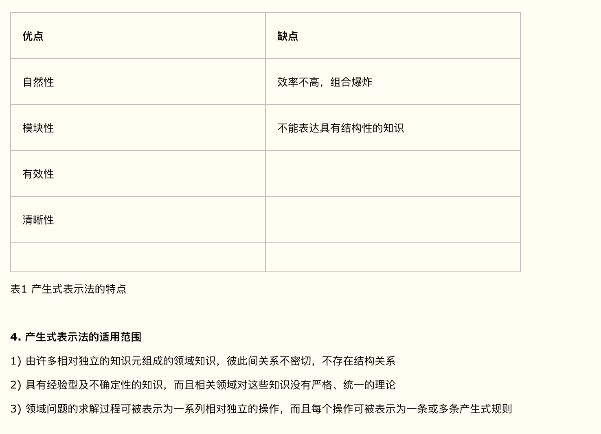
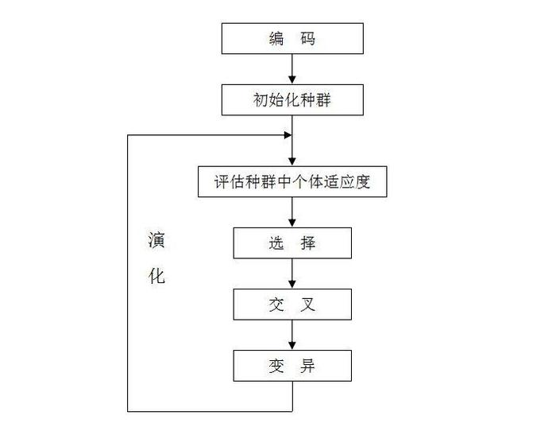

# 启发式搜索  

在A*算法中，启发性信息用一个特别的估价函数f*来表示：
f*(x)=g*(x)+h*(x)

式中：g*(x)为从初始节点到节点x的最佳路径所付出的代价；h*(x)是从x到目标节点的最佳路径所付出的代价；f*(x)是从初始节点出发通过节点x到达目标节点的最佳路径的总代价。

基于上述g*(x)和h*(x)的定义，对启发式搜索算法中的g(x)和h(x)做如下限制：

1. g(x)是对g*(x)的估计，且g(x)>0；

2. h(x)是h*(x)的下界，即对任意节点x均有h(x)≤h*(x)。
在满足上述条件情况下的有序搜索算法称为A*算法。

对于某一搜索算法，当最佳路径存在时，就一定能找到它，则称此算法是可纳的。可以证明，A*算法是可纳算法。也就是说，对于有序搜索算法，当满足h(x)≤h*(x)条件时，只要最佳路径存在，就一定能找出这条路径。
# bp神经网络特点关键步骤   

1. 正向传播

    输入样本-----输入层------各隐层--------输出层

1. 判断是否转入反向传播阶段
   
    若输入层的实际输出（h(x)）与期望的输出（y）不符。

2. 误差反传
   
    误差以某种形式在各层表示-----修正各层单元的权值（w或者Θ）

3. 最终结果
   
    网络输出的误差减少到了可以接受的程度（或 进行到预先设定的学习次数为止）

# 什么是人工智能  
- 弱人工智能，只能解决某一特定领域问题的人工智能，比如Alpha Go只能下围棋，微软小冰只能跟你瞎聊。目前所有的人工智能都是弱人工智能。
- 强人工智能，简单的来说，就是能够完成一个人能够完成的所有工作的人工智能。
- 超人工智能，这个定义很模糊，大概就是像科幻电影里面，比人强非常多倍的人工智能吧。

# 产生式 
一个产生式系统由以下三个基本部分组成：
1. 规则库

    用于描述相应领域内知识集合称为规则库。在建立规则库时应注意以下问题：

    有效地表达领域内的过程知识。规则库中存放的主要是过程性知识，用于实现对问题的求解。

    对知识进行合理的组织与管理，对规则库中的知识进行适当的组织，采用合理的结构形式，可使推理避免访问那些与当前问题求解无关的知识，从而提高求解问题效率。

2. 综合数据库

    综合数据库又称为事实库，上下文、黑板等。它是一个用于存放问题求解过程中各种当前信息的数据结构。当规则库中某条产生式的前提可与综合数据库中的某些已知事实匹配时，该产生式就被激活，并把它推出的结论放入综合数据库中，作为后面的推理的已知事实。显然，综合数据库的内容是不断变化的，是动态的。

3. 控制系统

    控制系统又称为推理机构，有一组程序组成，负责整个产生式系统的运行，实现对问题的求解。

## 产生式算法基本流程：

1. 初始化规则库，并获取事实库数据
2. 检查规则库是否还有未使用过规则，若无，则跳转至（5）
3. 匹配规则库与事实库中特征，若一轮规则匹配之后无任何匹配项，则跳转至（5）
4. 提取出可用规则结论，若结论为中间值，则将结论加入事实库，并进行新一轮的规则匹配，即跳转至（2）。若结论为最终答案，则直接输出，并结束程序运行
5. 若规则库中所有规则均无完全匹配项，则说明该问题无解，结束程序运行。
# 产生式表示法的特点

# 基础遗传算法  

# 遗传算法神经网络现实应用

1. 遗传算法目的是优化BP神经网络的初始权值和阈值，使用优化后的网络更好的预测。

2. 遗传算法来学习神经网络的最佳超参数